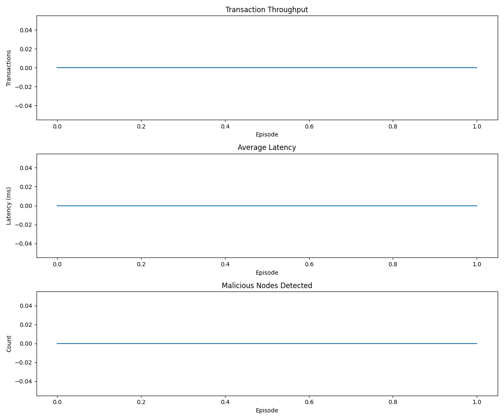

# QTrust: Tài liệu API và Hướng dẫn

<div align="center">
  
</div>

Tài liệu này mô tả chi tiết các API và thành phần của hệ thống QTrust, giúp nhà phát triển hiểu và mở rộng hệ thống.

## 📚 Mục lục

- [Tổng quan về kiến trúc](#tổng-quan-về-kiến-trúc)
- [Các module chính](#các-module-chính)
  - [BlockchainEnvironment](#1-blockchainenvironment)
  - [DQNAgent](#2-dqnagent)
  - [AdaptiveConsensus](#3-adaptiveconsensus)
  - [MADRAPIDRouter](#4-madrapidrouter)
  - [HTDCM](#5-htdcm-hierarchical-trust-data-center-mechanism)
  - [FederatedLearning](#6-federatedlearning)
- [Utilities](#utilities)
- [Luồng dữ liệu](#luồng-dữ-liệu)
- [Hướng dẫn nâng cao](#hướng-dẫn-nâng-cao)
  - [Tùy chỉnh Agent](#tùy-chỉnh-agent)
  - [Tùy chỉnh môi trường](#tùy-chỉnh-môi-trường)
  - [Tạo mô phỏng tùy chỉnh](#tạo-mô-phỏng-tùy-chỉnh)
- [Phân tích kết quả](#phân-tích-kết-quả)
- [Trực quan hóa](#trực-quan-hóa)

## Tổng quan về kiến trúc

QTrust bao gồm nhiều module phối hợp với nhau để tạo thành một hệ thống tối ưu hóa blockchain sharding toàn diện:

<div align="center">
```
                          ┌───────────────────┐
                          │  BlockchainEnv    │
                          └─────────┬─────────┘
                                    │
                                    ▼
┌───────────────────┐     ┌───────────────────┐     ┌───────────────────┐
│  AdaptiveConsensus│◄────┤     DQNAgent      ├────►│    MADRAPIDRouter │
└───────────────────┘     └───────────────────┘     └───────────────────┘
                                    │
                                    ▼
┌───────────────────┐     ┌───────────────────┐
│FederatedLearning  │◄────┤      HTDCM        │
└───────────────────┘     └───────────────────┘
```
</div>

### Luồng dữ liệu và tương tác

1. **BlockchainEnvironment** cung cấp trạng thái mạng cho **DQNAgent**
2. **DQNAgent** ra quyết định về định tuyến và giao thức đồng thuận
3. **AdaptiveConsensus** áp dụng giao thức đồng thuận thích hợp
4. **MADRAPIDRouter** xử lý định tuyến giao dịch dựa trên quyết định của agent
5. **HTDCM** đánh giá độ tin cậy của các nút mạng
6. **FederatedLearning** hỗ trợ phân phối kiến thức giữa các agent

## Các module chính

### 1. BlockchainEnvironment

Môi trường mô phỏng blockchain với sharding, cung cấp giao diện tương tác giữa các agent và mạng blockchain.

#### Class: BlockchainEnvironment

```python
from qtrust.simulation.blockchain_environment import BlockchainEnvironment

# Tạo môi trường
env = BlockchainEnvironment(
    num_shards=4,                   # Số lượng shard
    num_nodes_per_shard=10,         # Số nút mỗi shard
    max_transactions_per_step=100,  # Số giao dịch tối đa mỗi bước
    transaction_value_range=(0.1, 100.0),  # Phạm vi giá trị giao dịch
    max_steps=1000,                 # Số bước tối đa mỗi episode
    latency_penalty=0.5,            # Hệ số phạt độ trễ
    energy_penalty=0.3,             # Hệ số phạt năng lượng
    throughput_reward=1.0,          # Hệ số thưởng thông lượng
    security_reward=0.8             # Hệ số thưởng bảo mật
)

# Reset môi trường
state = env.reset()

# Thực hiện một bước
action = [1, 0]  # [shard_id, consensus_protocol]
next_state, reward, done, info = env.step(action)

# Lấy thông tin về môi trường
print(f"Số shard: {env.num_shards}")
print(f"Tổng số nút: {env.total_nodes}")
print(f"Thông lượng hiện tại: {env.current_throughput} tx/s")
print(f"Độ trễ trung bình: {env.average_latency} ms")
```

#### Không gian trạng thái

Môi trường sử dụng không gian trạng thái có kích thước `num_shards * 4 + 3 + 3`:
- 4 đặc trưng cho mỗi shard:
  - Mức độ tắc nghẽn (0-1)
  - Giá trị giao dịch trung bình
  - Điểm tin cậy trung bình của shard
  - Tỷ lệ giao dịch thành công
- 3 đặc trưng toàn cục:
  - Số giao dịch đang chờ
  - Độ trễ trung bình
  - Tỷ lệ giao dịch xuyên shard
- 3 phần tử cho tỷ lệ đồng thuận hiện tại

#### Không gian hành động

Không gian hành động bao gồm hai chiều:
- Lựa chọn shard đích (0 đến num_shards-1)
- Lựa chọn giao thức đồng thuận (0: Fast BFT, 1: PBFT, 2: Robust BFT)

#### Phương thức quan trọng

| Phương thức | Mô tả |
|-------------|-------|
| `reset()` | Khởi tạo lại môi trường về trạng thái ban đầu |
| `step(action)` | Thực hiện hành động và trả về state mới, reward, done, info |
| `render()` | Hiển thị trạng thái hiện tại của môi trường |
| `get_state()` | Lấy vector trạng thái hiện tại |
| `get_reward(action)` | Tính toán phần thưởng cho hành động |
| `is_terminal()` | Kiểm tra xem episode đã kết thúc chưa |

### 2. DQNAgent

Agent học tăng cường sâu cho việc ra quyết định trong môi trường blockchain.

#### Class: DQNAgent

```python
from qtrust.agents.dqn_agent import DQNAgent, QNetwork

# Tạo agent
agent = DQNAgent(
    state_space=state_space,            # Kích thước không gian trạng thái
    action_space=action_space,          # Kích thước không gian hành động
    num_shards=4,                       # Số lượng shard
    learning_rate=0.001,                # Tốc độ học
    gamma=0.99,                         # Hệ số giảm giá
    epsilon_start=1.0,                  # Epsilon ban đầu cho khám phá
    epsilon_end=0.01,                   # Epsilon tối thiểu
    epsilon_decay=0.995,                # Tốc độ giảm epsilon
    buffer_size=10000,                  # Kích thước bộ nhớ kinh nghiệm
    batch_size=64,                      # Kích thước batch
    update_target_every=100             # Cập nhật mạng đích sau bao nhiêu bước
)

# Chọn hành động từ trạng thái
state = env.reset()
action = agent.act(state)

# Học từ kinh nghiệm
next_state, reward, done, _ = env.step(action)
agent.step(state, action, reward, next_state, done)

# Huấn luyện agent
scores = agent.train(env, num_episodes=500, max_steps=1000)

# Lưu và tải mô hình
agent.save('models/dqn_model.pth')
agent.load('models/dqn_model.pth')

# Đánh giá agent
eval_scores = agent.evaluate(env, num_episodes=10)
print(f"Điểm trung bình: {np.mean(eval_scores)}")
```

#### Kiến trúc QNetwork

QNetwork là mạng neural sử dụng trong DQNAgent với kiến trúc sau:

```python
class QNetwork(nn.Module):
    def __init__(self, state_size, action_dims, hidden_sizes=[64, 64]):
        super(QNetwork, self).__init__()
        self.state_size = state_size
        self.action_dims = action_dims
        
        # Tầng đầu vào
        layers = [nn.Linear(state_size, hidden_sizes[0]),
                  nn.ReLU()]
        
        # Tầng ẩn
        for i in range(len(hidden_sizes)-1):
            layers.extend([
                nn.Linear(hidden_sizes[i], hidden_sizes[i+1]),
                nn.ReLU()
            ])
            
        self.shared_layers = nn.Sequential(*layers)
        
        # Tầng ra quyết định shard
        self.shard_head = nn.Linear(hidden_sizes[-1], action_dims[0])
        
        # Tầng ra quyết định giao thức
        self.protocol_head = nn.Linear(hidden_sizes[-1], action_dims[1])
        
    def forward(self, state):
        x = self.shared_layers(state)
        shard_values = self.shard_head(x)
        protocol_values = self.protocol_head(x)
        return shard_values, protocol_values
```

#### Phương thức quan trọng

| Phương thức | Mô tả |
|-------------|-------|
| `act(state)` | Chọn hành động dựa trên trạng thái hiện tại |
| `step(state, action, reward, next_state, done)` | Lưu kinh nghiệm và học nếu đủ điều kiện |
| `learn()` | Thực hiện quá trình học từ bộ nhớ kinh nghiệm |
| `train(env, num_episodes, max_steps)` | Huấn luyện agent trên môi trường |
| `evaluate(env, num_episodes)` | Đánh giá hiệu suất của agent |
| `save(path)` | Lưu mô hình |
| `load(path)` | Tải mô hình đã lưu |

### 3. AdaptiveConsensus

Chuyển đổi động giữa các giao thức đồng thuận dựa trên điều kiện mạng.

#### Class: AdaptiveConsensus

```python
from qtrust.consensus.adaptive_consensus import AdaptiveConsensus, ConsensusProtocol

# Tạo adaptive consensus
consensus = AdaptiveConsensus(
    num_shards=4,                   # Số lượng shard
    protocols=['fast_bft', 'pbft', 'robust_bft']  # Các giao thức hỗ trợ
)

# Chọn protocol phù hợp
protocol = consensus.select_protocol(
    shard_id=1,                     # ID của shard
    network_congestion=0.2,         # Mức độ tắc nghẽn mạng
    trust_score=0.8,                # Điểm tin cậy
    transaction_value=50.0          # Giá trị giao dịch
)

# Áp dụng giao thức và nhận kết quả
result = consensus.apply_protocol(
    shard_id=1,                     # ID của shard
    protocol=protocol,              # Giao thức đã chọn
    transactions=tx_list            # Danh sách giao dịch
)

# Lấy thông tin hiệu suất
latency = consensus.get_protocol_latency(protocol, network_congestion)
energy = consensus.get_protocol_energy_consumption(protocol)
security = consensus.get_protocol_security_level(protocol, trust_score)
```

#### Các giao thức đồng thuận

| Giao thức | Mô tả | Ưu điểm | Nhược điểm |
|-----------|-------|---------|------------|
| Fast BFT | BFT nhanh, tối ưu cho mạng ít tắc nghẽn | Độ trễ thấp, tiêu thụ năng lượng thấp | Bảo mật thấp hơn |
| PBFT | Practical Byzantine Fault Tolerance | Cân bằng tốt giữa hiệu suất và bảo mật | Tiêu thụ nhiều tài nguyên hơn |
| Robust BFT | BFT tăng cường bảo mật | Bảo mật cao nhất | Độ trễ cao, tiêu thụ nhiều năng lượng |

#### Phương thức quan trọng

| Phương thức | Mô tả |
|-------------|-------|
| `select_protocol(...)` | Chọn giao thức đồng thuận phù hợp với điều kiện |
| `apply_protocol(...)` | Áp dụng giao thức đã chọn cho các giao dịch |
| `get_protocol_latency(...)` | Ước tính độ trễ cho giao thức |
| `get_protocol_energy_consumption(...)` | Ước tính mức tiêu thụ năng lượng |
| `get_protocol_security_level(...)` | Ước tính mức độ bảo mật |
| `get_consensus_distribution()` | Lấy phân phối hiện tại của các giao thức |

### 4. MADRAPIDRouter

Hệ thống định tuyến giao dịch thông minh đa tác tử.

#### Class: MADRAPIDRouter

```python
from qtrust.routing.mad_rapid import MADRAPIDRouter

# Tạo router
router = MADRAPIDRouter(
    num_shards=4,                   # Số lượng shard
    network_topology=network_graph  # Topology mạng (NetworkX graph)
)

# Định tuyến giao dịch
route = router.route_transaction(
    transaction=tx,                 # Giao dịch cần định tuyến
    current_shard=0,                # Shard hiện tại
    congestion_levels=[0.2, 0.5, 0.8, 0.3]  # Mức độ tắc nghẽn của các shard
)

# Lấy thông tin về đường đi và hops
path, num_hops = router.get_path_info(source_shard=0, destination_shard=2)

# Phân tích hiệu suất định tuyến
metrics = router.analyze_routing_performance(transactions=txs, paths=paths)
print(f"Độ trễ trung bình: {metrics['avg_latency']} ms")
print(f"Số hop trung bình: {metrics['avg_hops']}")
print(f"Tỷ lệ thành công: {metrics['success_rate']}")
```

#### Thuật toán định tuyến

MADRAPIDRouter sử dụng kết hợp các thuật toán sau:
1. **Q-Learning**: Học từ kinh nghiệm định tuyến trước đó
2. **Dijkstra's**: Tìm đường đi ngắn nhất trong mạng
3. **Ant Colony Optimization**: Tối ưu hóa đường đi dựa trên "mùi" của đường đi thành công
4. **Congestion Prediction**: Dự đoán tắc nghẽn dựa trên dữ liệu lịch sử

#### Phương thức quan trọng

| Phương thức | Mô tả |
|-------------|-------|
| `route_transaction(...)` | Định tuyến giao dịch đến shard phù hợp |
| `get_path_info(...)` | Lấy thông tin về đường đi giữa các shard |
| `update_network_topology(...)` | Cập nhật topology mạng |
| `predict_congestion(...)` | Dự đoán mức độ tắc nghẽn trong tương lai |
| `analyze_routing_performance(...)` | Phân tích hiệu suất định tuyến |

### 5. HTDCM (Hierarchical Trust Data Center Mechanism)

Cơ chế đánh giá và quản lý tin cậy phân cấp.

#### Class: HTDCM

```python
from qtrust.trust.htdcm import HTDCM

# Tạo trust mechanism
trust_mechanism = HTDCM(
    num_nodes=40,                   # Tổng số nút
    num_shards=4,                   # Số lượng shard
    initial_trust=0.5,              # Điểm tin cậy ban đầu
    alpha=0.8,                      # Hệ số học
    detection_threshold=0.3         # Ngưỡng phát hiện nút độc hại
)

# Cập nhật điểm tin cậy cho node
trust_mechanism.update_trust_score(
    node_id=5,                      # ID của nút
    transaction_success=True,       # Giao dịch thành công?
    response_time=0.2               # Thời gian phản hồi
)

# Phát hiện nút độc hại
malicious_nodes = trust_mechanism.detect_malicious_nodes(
    threshold=0.3                   # Ngưỡng tin cậy
)

# Lấy trust scores
shard_trust = trust_mechanism.get_shard_trust_scores()
node_trust = trust_mechanism.get_node_trust_scores()

# Phân tích tấn công
attack_detected = trust_mechanism.analyze_attack_patterns(recent_transactions)
if attack_detected:
    attack_type = trust_mechanism.identify_attack_type()
    print(f"Phát hiện tấn công: {attack_type}")
```

#### Các mức đánh giá tin cậy

HTDCM hoạt động trên 3 mức:
1. **Node-level**: Đánh giá từng nút dựa trên hành vi và hiệu suất
2. **Shard-level**: Đánh giá mức độ tin cậy của toàn bộ shard
3. **Network-level**: Phát hiện mẫu tấn công và bất thường trong mạng

#### Phương thức quan trọng

| Phương thức | Mô tả |
|-------------|-------|
| `update_trust_score(...)` | Cập nhật điểm tin cậy của nút |
| `detect_malicious_nodes(...)` | Phát hiện nút độc hại |
| `get_shard_trust_scores()` | Lấy điểm tin cậy của các shard |
| `get_node_trust_scores()` | Lấy điểm tin cậy của các nút |
| `analyze_attack_patterns(...)` | Phân tích mẫu tấn công |
| `identify_attack_type()` | Xác định loại tấn công |
| `isolate_malicious_nodes(...)` | Cô lập các nút độc hại |

### 6. FederatedLearning

Học tập liên hợp cho các agent DQN phân tán.

#### Class: FederatedLearning

```python
from qtrust.federated.federated_learning import FederatedLearning, FederatedModel, FederatedClient

# Tạo mô hình liên hợp
federated_model = FederatedModel(
    state_size=20,                  # Kích thước trạng thái
    action_dim=[4, 3],              # Kích thước hành động
    hidden_sizes=[128, 128]         # Kích thước các tầng ẩn
)

# Tạo client liên hợp
clients = [
    FederatedClient(agent=agent1, node_id=1),
    FederatedClient(agent=agent2, node_id=2),
    # ...
]

# Tạo hệ thống học tập liên hợp
federated_system = FederatedLearning(
    model=federated_model,          # Mô hình liên hợp
    clients=clients,                # Các client tham gia
    rounds=10,                      # Số vòng học tập
    local_epochs=5,                 # Số epoch học tập cục bộ
    min_clients=3,                  # Số client tối thiểu cần tham gia
    privacy_level='differential'    # Phương pháp bảo vệ quyền riêng tư
)

# Huấn luyện
federated_system.train()

# Đánh giá
global_performance = federated_system.evaluate()
print(f"Hiệu suất global: {global_performance}")

# Cập nhật mô hình cho client mới
federated_system.update_client_model(new_client)
```

#### Luồng học tập liên hợp

1. Server phân phối mô hình global đến các client
2. Mỗi client huấn luyện cục bộ trên dữ liệu riêng
3. Client gửi lại các thông số đã cập nhật lên server
4. Server tổng hợp thông số từ các client
5. Server cập nhật mô hình global
6. Quá trình lặp lại từ bước 1

#### Phương thức quan trọng

| Phương thức | Mô tả |
|-------------|-------|
| `train()` | Huấn luyện mô hình liên hợp |
| `aggregate_models(...)` | Tổng hợp mô hình từ các client |
| `distribute_model()` | Phân phối mô hình global đến các client |
| `evaluate()` | Đánh giá hiệu suất của mô hình global |
| `add_client(...)` | Thêm client mới vào hệ thống |
| `update_client_model(...)` | Cập nhật mô hình cho client cụ thể |

## Utilities

### Module: data_generation

```python
from qtrust.utils.data_generation import (
    generate_network_topology,
    assign_nodes_to_shards,
    generate_transactions
)

# Tạo topology mạng
network = generate_network_topology(
    num_nodes=40,                   # Số lượng nút
    connection_probability=0.3      # Xác suất kết nối
)

# Phân phối node vào các shard
shards = assign_nodes_to_shards(
    network=network,                # Topology mạng
    num_shards=4,                   # Số lượng shard
    strategy='balanced'             # Chiến lược phân phối
)

# Tạo giao dịch
transactions = generate_transactions(
    num_transactions=100,           # Số lượng giao dịch
    value_range=(0.1, 100.0),       # Phạm vi giá trị
    cross_shard_probability=0.3     # Xác suất giao dịch xuyên shard
)
```

### Module: metrics

```python
from qtrust.utils.metrics import (
    calculate_throughput,
    calculate_latency,
    calculate_security_score,
    calculate_energy_consumption,
    evaluate_overall_performance
)

# Tính toán các chỉ số hiệu suất
throughput = calculate_throughput(transactions_processed, time_elapsed)
latency = calculate_latency(transaction_times)
security = calculate_security_score(consensus_distribution, trust_scores)
energy = calculate_energy_consumption(consensus_distribution, num_nodes)

# Đánh giá tổng thể
performance = evaluate_overall_performance(
    throughput=throughput,
    latency=latency,
    security=security,
    energy=energy,
    weights={
        'throughput': 0.3,
        'latency': 0.3,
        'security': 0.2,
        'energy': 0.2
    }
)
```

## Luồng dữ liệu

Sơ đồ dưới đây minh họa luồng dữ liệu trong hệ thống QTrust:

<div align="center">
```
┌─────────────────┐          ┌─────────────────┐          ┌─────────────────┐
│   Transactions  │──────────►    DQNAgent     │──────────►  Route Decision  │
└─────────────────┘          └─────────────────┘          └─────────────────┘
        │                             │                            │
        │                             │                            │
        ▼                             ▼                            ▼
┌─────────────────┐          ┌─────────────────┐          ┌─────────────────┐
│ BlockchainState │◄─────────┤  Reward Signal  │◄─────────┤  Performance    │
└─────────────────┘          └─────────────────┘          └─────────────────┘
        │                                                         ▲
        │                                                         │
        ▼                                                         │
┌─────────────────┐          ┌─────────────────┐          ┌─────────────────┐
│  Trust Updates  │──────────►  Protocol Select │──────────► Transaction Exec │
└─────────────────┘          └─────────────────┘          └─────────────────┘
```
</div>

## Hướng dẫn nâng cao

### Tùy chỉnh Agent

Để tạo Agent tùy chỉnh, bạn có thể mở rộng từ lớp cơ sở:

```python
from qtrust.agents.base_agent import BaseAgent
from qtrust.agents.dqn_agent import QNetwork
import torch.optim as optim

class CustomAgent(BaseAgent):
    def __init__(self, state_space, action_space, **kwargs):
        super().__init__(state_space, action_space)
        # Khởi tạo tùy chỉnh
        self.network = QNetwork(state_space, action_space, hidden_sizes=[256, 128])
        self.optimizer = optim.Adam(self.network.parameters(), lr=kwargs.get('learning_rate', 0.001))
        
    def act(self, state):
        # Lựa chọn hành động
        pass
    
    def learn(self):
        # Cài đặt thuật toán học
        pass
```

### Tùy chỉnh môi trường

Môi trường tùy chỉnh có thể được xây dựng bằng cách mở rộng lớp BlockchainEnvironment:

```python
from qtrust.simulation.blockchain_environment import BlockchainEnvironment

class CustomEnvironment(BlockchainEnvironment):
    def __init__(self, **kwargs):
        super().__init__(**kwargs)
        # Thêm các thông số tùy chỉnh
        self.custom_parameter = kwargs.get('custom_parameter', 0)
    
    def reset(self):
        # Reset môi trường với logic tùy chỉnh
        state = super().reset()
        # Thêm logic tùy chỉnh
        return state
    
    def step(self, action):
        # Logic tùy chỉnh cho bước môi trường
        return super().step(action)
    
    def custom_method(self):
        # Phương thức tùy chỉnh
        pass
```

### Tạo mô phỏng tùy chỉnh

Bạn có thể tạo mô phỏng tùy chỉnh bằng cách tích hợp các thành phần:

```python
# Tạo môi trường tùy chỉnh
env = CustomEnvironment(
    num_shards=8,
    num_nodes_per_shard=15,
    max_steps=1000
)

# Tạo agent
agent = CustomAgent(
    state_space=env.state_size,
    action_space=env.action_dims,
    learning_rate=0.0005
)

# Tạo consensus
consensus = AdaptiveConsensus(num_shards=8)

# Thiết lập mô phỏng
for episode in range(num_episodes):
    state = env.reset()
    for step in range(max_steps):
        action = agent.act(state)
        
        # Xử lý consensus
        protocol = action[1]
        consensus.apply_protocol(action[0], protocol)
        
        # Thực hiện hành động
        next_state, reward, done, info = env.step(action)
        
        # Học từ kinh nghiệm
        agent.step(state, action, reward, next_state, done)
        
        if done:
            break
        
        state = next_state
```

## Phân tích kết quả

QTrust cung cấp các công cụ để phân tích kết quả mô phỏng:

```python
from qtrust.utils.analysis import (
    load_simulation_results,
    compare_configurations,
    plot_performance_metrics,
    analyze_attack_resilience
)

# Tải kết quả
results = load_simulation_results('results/summary_qtrust_full_20250323_063732.txt')

# So sánh cấu hình
comparison = compare_configurations([
    'results/summary_basic_20250323_063729.txt',
    'results/summary_adaptive_consensus_20250323_063730.txt',
    'results/summary_dqn_routing_20250323_063731.txt',
    'results/summary_qtrust_full_20250323_063732.txt'
])

# Vẽ biểu đồ
plot_performance_metrics(comparison, save_path='charts/comparison.png')

# Phân tích khả năng chống tấn công
resilience = analyze_attack_resilience(
    'results_comparison/attack_comparison/attack_comparison_20250323_064020.txt'
)
```

## Trực quan hóa

QTrust hỗ trợ nhiều công cụ trực quan hóa:

```python
from qtrust.utils.visualization import (
    plot_network_topology,
    plot_shard_distribution,
    plot_training_progress,
    create_radar_chart,
    plot_attack_comparison
)

# Vẽ topology mạng
plot_network_topology(network, shards, save_path='charts/topology.png')

# Vẽ phân phối shard
plot_shard_distribution(shards, trust_scores, save_path='charts/distribution.png')

# Vẽ tiến trình huấn luyện
plot_training_progress(training_rewards, save_path='charts/training.png')

# Tạo biểu đồ radar
create_radar_chart(
    ['Throughput', 'Latency', 'Security', 'Energy', 'Cross-shard Rate'],
    [metrics['basic'], metrics['qtrust']],
    ['Basic', 'QTrust'],
    save_path='charts/radar.png'
)

# Vẽ so sánh khả năng chống tấn công
plot_attack_comparison(attack_results, save_path='charts/attack_comparison.png')
``` 