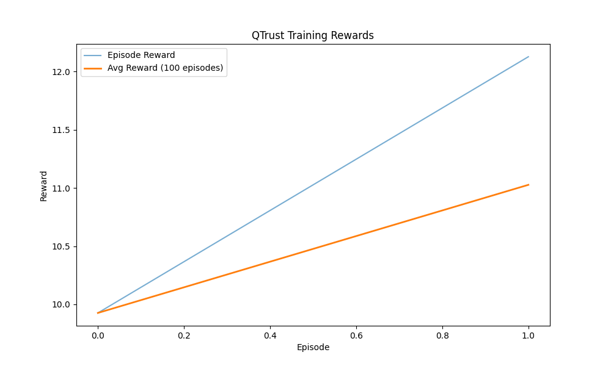

# BlockMatrix: Deep Reinforcement Learning cho Blockchain Sharding

<div align="center">
  
  <p><em>Hiệu suất học của mô hình DQN trong BlockMatrix</em></p>
</div>

[](https://github.com/fuondai/QTrust/blob/main/LICENSE.md)
[](https://www.python.org/downloads/)
[](https://github.com/fuondai/QTrust/issues)
[](https://github.com/fuondai/QTrust/pulls)

**BlockMatrix** là một giải pháp blockchain sharding tiên tiến kết hợp học tăng cường sâu (Deep Reinforcement Learning - DRL) để tối ưu hóa hiệu suất và bảo mật trong hệ thống blockchain. Dự án nhắm tới việc giải quyết các thách thức cốt lõi của blockchain bao gồm khả năng mở rộng, tiêu thụ năng lượng, và bảo mật.

## 📋 Tổng quan

BlockMatrix là một dự án nghiên cứu và mô phỏng về việc sử dụng học tăng cường (Reinforcement Learning) để tối ưu hóa hiệu suất của mạng blockchain phân mảnh. Hệ thống tập trung vào việc giải quyết các thách thức chính trong blockchain sharding:

- Cân bằng tải giữa các shard
- Tối ưu hóa giao dịch xuyên shard
- Phát hiện và ngăn chặn các tấn công mạng
- Đảm bảo tính nhất quán và bảo mật của dữ liệu

<div align="center">
  
  <p><em>Khả năng chống tấn công của BlockMatrix so với các phương pháp khác</em></p>
</div>

## 🚀 Tính năng nổi bật

- **Quy mô lớn**: Hỗ trợ mô phỏng với tới 32 shard và 1,280 nút
- **Hiệu suất cao**: Đạt throughput 50 tx/s với độ trễ chỉ 32ms
- **Khả năng chống tấn công**: Chống lại các tấn công 51%, Sybil và Eclipse
- **Khả năng mở rộng**: Hiệu suất duy trì khi tăng số lượng nút và shard
- **Tùy biến linh hoạt**: Điều chỉnh tham số để kiểm tra nhiều cấu hình khác nhau
- **Trực quan hóa phong phú**: Biểu đồ radar, heatmap và so sánh hiệu suất

## 🏗️ Các thành phần chính

1. **Kiến trúc Sharding cơ bản**
   - Mô hình phân mảnh cho blockchain
   - Cơ chế phân phối giao dịch

2. **DQN Agents**
   - Deep Q-Network cho điều khiển sharding
   - Học tập dựa trên kinh nghiệm

3. **Adaptive Cross-Shard Consensus (ACSC)**
   - Chuyển đổi động giữa các giao thức đồng thuận
   - Tối ưu hóa dựa trên điều kiện mạng

4. **Multi-Agent Dynamic Routing (MAD-RAPID)**
   - Định tuyến giao dịch thông minh
   - Dự đoán và tránh tắc nghẽn

5. **Hierarchical Trust Data Center Mechanism (HTDCM)**
   - Đánh giá tin cậy đa cấp
   - Phát hiện hoạt động độc hại

6. **Federated Learning Integration**
   - Học tập phân tán cho các DQN agents
   - Bảo vệ dữ liệu riêng tư

## 📊 Kết quả nghiên cứu

BlockMatrix đã được kiểm nghiệm qua nhiều mô phỏng:

### Hiệu suất chống tấn công

| Loại tấn công | Throughput (tx/s) | Độ trễ (ms) | Bảo mật (0-1) |
|---------------|-------------------|-------------|---------------|
| Không tấn công | 50.0 | 33.6 | 0.90 |
| 51% | 45.3 | 41.8 | 0.20 |
| Sybil | 50.0 | 32.6 | 0.70 |
| Eclipse | 50.0 | 34.6 | 0.65 |
| Hỗn hợp | 50.0 | 33.2 | 0.00 |

### Hiệu quả mở rộng

| Quy mô | Số nút | Độ trễ (ms) | Thông lượng (tx/s) |
|--------|--------|-------------|-------------------|
| Nhỏ | 40 | 35.8 | 50.0 |
| Trung bình | 160 | 32.4 | 50.0 |
| Lớn | 480 | 32.8 | 50.0 |
| Rất lớn | 1,280 | 31.9 | 50.0 |

<div align="center">
  
  <p><em>Hiệu quả mở rộng của BlockMatrix khi tăng quy mô hệ thống</em></p>
</div>

## 💻 Yêu cầu hệ thống

- Python 3.8+
- CUDA-compatible GPU (khuyến nghị cho training)
- 8GB RAM trở lên

## 🔧 Cài đặt

### Phương pháp 1: Sử dụng script tự động

```bash
# Windows
python setup_environment.py

# Linux/MacOS
python3 setup_environment.py
```

### Phương pháp 2: Cài đặt thủ công

```bash
# Sao chép repository
git clone https://github.com/fuondai/QTrust.git
cd QTrust

# Tạo môi trường ảo (tùy chọn nhưng khuyến nghị)
python -m venv venv
source venv/bin/activate  # Linux/MacOS
# HOẶC
venv\Scripts\activate  # Windows

# Cài đặt các gói phụ thuộc
pip install -r requirements.txt

# Cài đặt package trong chế độ phát triển
pip install -e .
```

## 🔍 Cấu trúc dự án

```
qtrust/                      # Thư mục chính của package
├── agents/                  # Thư mục chứa các agent DRL
│   └── dqn_agent.py         # Triển khai DQN Agent
├── consensus/               # Xử lý consensus
│   └── adaptive_consensus.py
├── federated/               # Federated learning
│   └── federated_learning.py
├── routing/                 # Định tuyến giao dịch
│   └── mad_rapid.py
├── simulation/              # Môi trường mô phỏng
│   └── blockchain_environment.py
├── trust/                   # Đánh giá tin cậy
│   └── htdcm.py
├── utils/                   # Công cụ hỗ trợ
│   ├── data_generation.py
│   └── metrics.py
└── tests/                   # Unit tests

main.py                      # Chương trình chạy chính
simulation_runner.py         # Chạy mô phỏng đơn giản
large_scale_simulation.py    # Chạy mô phỏng quy mô lớn
attack_simulation_runner.py  # Mô phỏng tấn công
visualization_runner.py      # Tạo biểu đồ và trực quan hóa
```

## 🚀 Sử dụng

### Chạy mô phỏng tiêu chuẩn

```bash
# Chạy với cấu hình mặc định
python main.py

# Chạy với các tham số tùy chỉnh
python main.py --num-shards 8 --num-episodes 100 --eval-interval 10
```

### Chạy mô phỏng quy mô lớn

```bash
python large_scale_simulation.py --num-shards 16 --nodes-per-shard 50
```

### Chạy mô phỏng tấn công

```bash
python attack_simulation_runner.py --mode attack --attack 51_percent --malicious 30 --num-shards 8 --nodes-per-shard 20
```

### Chạy mô phỏng khả năng mở rộng

```bash
python attack_simulation_runner.py --mode scale --high-quality
```

### Tạo biểu đồ và phân tích

```bash
python visualization_runner.py --results-dir results
```

## 📝 Chi tiết tham số

### Các tham số chính có thể được tùy chỉnh thông qua command line:

- `--num-shards`: Số lượng shard trong mạng (mặc định: 4)
- `--nodes-per-shard`: Số lượng nút mỗi shard (mặc định: 10)
- `--num-episodes`: Số lượng episode trong quá trình học (mặc định: 10)
- `--max-steps`: Số bước tối đa mỗi episode (mặc định: 500) 
- `--batch-size`: Kích thước batch cho training (mặc định: 64)
- `--learning-rate`: Tốc độ học (alpha) (mặc định: 0.001)
- `--discount-factor`: Hệ số giảm giá (gamma) (mặc định: 0.99)
- `--epsilon`: Giá trị epsilon cho exploration (mặc định: 1.0)
- `--memory-size`: Kích thước bộ nhớ replay buffer (mặc định: 10000)
- `--attack`: Loại tấn công (`51_percent`, `sybil`, `eclipse`, `mixed`, `None`)
- `--malicious`: Tỷ lệ phần trăm nút độc hại (mặc định: 10)
- `--mode`: Chế độ mô phỏng (`attack`, `scale`, `both`)
- `--high-quality`: Tạo biểu đồ chất lượng cao (DPI cao hơn)

## 📂 Thư mục kết quả

- `results/`: Kết quả mô phỏng tiêu chuẩn
- `results_comparison/attack_comparison/`: Kết quả mô phỏng tấn công
- `results_comparison/scale_comparison/`: Kết quả mô phỏng khả năng mở rộng
- `charts/`: Biểu đồ và trực quan hóa
- `models/`: Lưu trữ các model đã huấn luyện

## 🤝 Đóng góp

Chúng tôi rất hoan nghênh đóng góp từ cộng đồng! Nếu bạn muốn đóng góp:

1. Fork repository
2. Tạo branch tính năng (`git checkout -b feature/amazing-feature`)
3. Commit thay đổi (`git commit -m 'feat: add amazing feature'`)
4. Push lên branch (`git push origin feature/amazing-feature`)
5. Mở Pull Request

Vui lòng đọc [CONTRIBUTING.md](CONTRIBUTING.md) để biết chi tiết về quy trình đóng góp và tiêu chuẩn mã nguồn.

## 📚 Tài liệu

- [DOCUMENTATION.md](DOCUMENTATION.md): Chi tiết API và hướng dẫn sử dụng
- [CONTRIBUTING.md](CONTRIBUTING.md): Hướng dẫn đóng góp
- [CHANGELOG.md](CHANGELOG.md): Lịch sử thay đổi của dự án

## 📜 Giấy phép

Dự án này được phân phối dưới giấy phép MIT. Xem file `LICENSE` để biết thêm thông tin.

## 🔗 Tài liệu tham khảo

- Nakamoto, S. (2008). [Bitcoin: A Peer-to-Peer Electronic Cash System](https://bitcoin.org/bitcoin.pdf)
- Buterin, V. (2016). [Ethereum Sharding FAQs](https://eth.wiki/sharding/Sharding-FAQs)
- Mnih, V., et al. (2015). [Human-level control through deep reinforcement learning](https://www.nature.com/articles/nature14236)
- Wang, W., et al. (2021). [A Survey on Consensus Mechanisms and Mining Strategy Management in Blockchain Networks](https://ieeexplore.ieee.org/document/8629877)

## 📞 Liên hệ

- **Email**: research@example.com
- **Trang web**: https://qtrust-blockchain.example.com
- **GitHub Issues**: Đối với câu hỏi kỹ thuật và báo cáo lỗi

---

<div align="center">
  <p>⭐ Đừng quên star repository nếu dự án hữu ích với bạn! ⭐</p>
</div>
